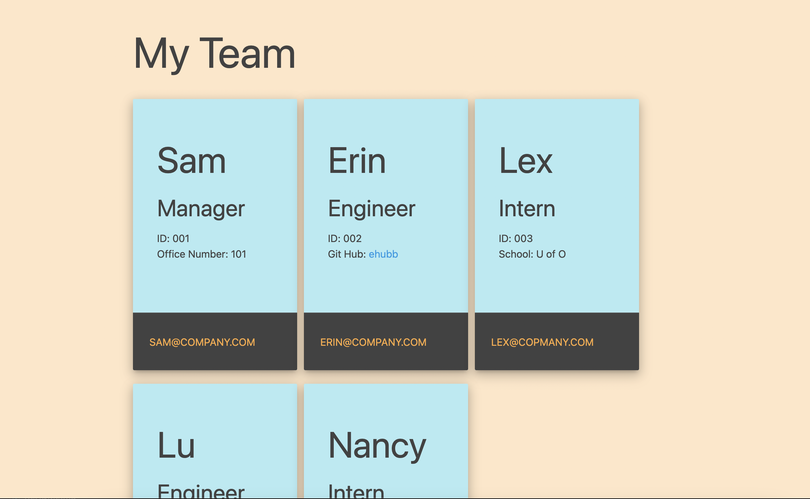

# Profile Generator

## Description
An Node.js application that allows users to generate a webpage of their team profile. Uses Jest for test driven development and the Inquirer npm package to prompt users for input.
## Use
A command-line application that accepts user input.

- WHEN I am prompted for my team members and their information, an HTML file is generated that displays a nicely formatted team roster based on user input
- WHEN I click on an email address in the HTML, my default email program opens and populates the TO field of the email with the address
- WHEN I click on the GitHub username, that GitHub profile opens in a new tab
- WHEN I start the application, I am prompted to enter the team manager’s name, employee ID, email address, and office number
- WHEN I enter the team manager’s name, employee ID, email address, and office number, I am presented with a menu with the option to add an engineer or an intern or to finish building my team
- WHEN I select the engineer option, I am prompted to enter the engineer’s name, ID, email, and GitHub username, and I am taken back to the menu
- WHEN I select the intern option, I am prompted to enter the intern’s name, ID, email, and school, and I am taken back to the menu
- WHEN I decide to finish building my team, I exit the application, and the HTML is generated

## Layout

## Link
[Demonstration Video](https://watch.screencastify.com/v/C9pSiC3RDwUd8M9AlEJZ)